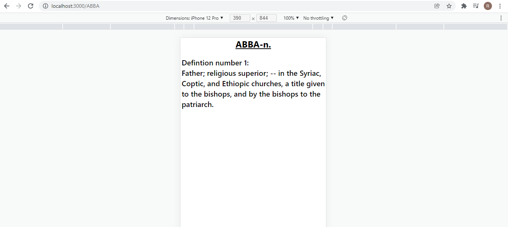

# Dictionary Client Repo

## What this repo stands for

Welcome to dictionary-client readme, this app can should recive word and bring you it's defintions.
This app is currently ONLY mobile app.

## Features

1. All the words are clickable and will direct you to their defnitions.
2. Get word.
3. Get word by pos.
4. Get random word by pos.

## Screenshots

### 1. /:Word Get an exact word - One defintion

### 1. /:Word Get an exact word - Many defintions

### 1. /:Word/:Pos Get an exact word by it's pos

### 1. /part-of-speech/:Pos Get a random word by pos

### 1. /part-of-speech/:Pos?letter= Get a random word by pos and begging of the word

